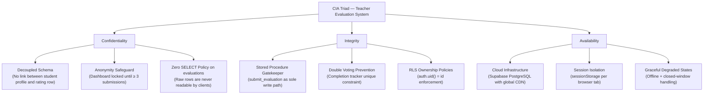

# Teacher Evaluation System
### IAS102 — Information Assurance & Security | 2nd Semester Final Project

> A web-based teacher evaluation platform built to demonstrate the practical application of the **CIA Triad** — Confidentiality, Integrity, and Availability — in a real-world academic system. Students evaluate teachers anonymously; administrators manage access and oversight; teachers view aggregated performance metrics.

---

## Table of Contents

1. [System Overview](#1-system-overview)
2. [CIA Triad Implementation](#2-cia-triad-implementation)
   - [Confidentiality](#21-confidentiality)
   - [Integrity](#22-integrity)
   - [Availability](#23-availability)
3. [Role-Based Access Control](#3-role-based-access-control)
4. [Database Schema & RLS Policies](#4-database-schema--rls-policies)
5. [IAS Security Analysis](#5-ias-security-analysis)
   - [Design Weaknesses & Loopholes](#51-design-weaknesses--loopholes)
   - [Known Vulnerabilities](#52-known-vulnerabilities)
   - [Implemented Fallbacks](#53-implemented-fallbacks)
6. [Setup & Local Execution](#6-setup--local-execution)

---

## 1. System Overview

The Teacher Evaluation System is a full-stack web application developed as a final project for IAS102 — Information Assurance & Security (2nd Semester). Every architectural decision — from database schema design to session handling — is intentionally mapped to one or more pillars of the CIA Triad.

### Key Features

| Feature | Description |
| :--- | :--- |
| **Role-Based Access Control (RBAC)** | Distinct dashboards and access scopes for Students, Faculty, and Admins |
| **Verification Queue** | Manual registration gate — admins review uploaded Student IDs before granting access |
| **Decoupled Evaluation Engine** | Secure, transaction-safe submission path that prevents student deanonymization |
| **Analytics Dashboard** | Dynamic radar charts and progress tracking for teacher evaluation scores |
| **Anti-Coercion Lock** | Analytics locked until a subject receives ≥ 3 evaluations to prevent deductive profiling |
| **Dynamic Window Control** | Admins can open/close the evaluation window and configure semester/academic year globally |

---

## 2. CIA Triad Implementation

The diagram below maps each pillar of the CIA Triad to its corresponding system implementation:



---

### 2.1 Confidentiality

**Goal:** Ensure sensitive information is accessed only by authorized parties, and that individual student identities are protected from deductive exposure.

#### Decoupled Anonymity Schema

The system separates *identity* from *evaluation data* at the schema level:

- The `profiles` table stores student identity information.
- When a student submits an evaluation, their `student_id` is written **only** to the `evaluation_completion_tracker` — marking completion for that subject.
- The `evaluations` table stores **raw scores only**, with no foreign key or reference back to the student who submitted them.

This means there is no JOIN possible between a student's identity and their submitted scores.

#### Anti-Coercion Anonymity Lock

In classes with very few students, even anonymized aggregate data can be deductively reversed (e.g., a class of 2 students where one teacher sees a score drop after one student is absent). To prevent this:

- The teacher dashboard displays a **Locked** state for any subject with **fewer than 3 submissions**.
- Analytics are only surfaced once the threshold is met, making individual attribution statistically infeasible.

#### Zero SELECT Policy on Evaluations

No client role — neither student nor teacher — holds a `SELECT` policy on the `evaluations` table. The only permitted access paths are:

- **Aggregated views** (`teacher_analytics`) — returns computed averages, not raw rows.
- **Security-defined RPC procedures** — controlled server-side execution only.

---

### 2.2 Integrity

**Goal:** Prevent unauthorized or duplicate data modifications, and ensure evaluations are authentic, non-repudiable, and written through a single verified path.

#### Single-Gatekeeper Stored Procedure (`submit_evaluation`)

Client applications cannot write directly to the `evaluations` table. RLS enforces a `WITH CHECK (false)` rule that blocks all direct inserts. Instead, all evaluation writes are routed through the `submit_evaluation` database function (`SECURITY DEFINER`), which executes the following atomically in a single transaction:

1. Verifies the global evaluation window is currently open.
2. Verifies the student has not already submitted an evaluation for the target subject.
3. Writes to both `evaluation_completion_tracker` and `evaluations` atomically.

This ensures no partial writes, no duplicate submissions, and no bypassing of business rules.

#### Row-Level Security (RLS) Ownership Policies

Strict access boundaries are enforced at the database tier:

- Students can only `SELECT` and `UPDATE` their own profile row (`auth.uid() = id`).
- Only a pre-authorized admin account can approve or reject users in the verification queue.
- Email pattern constraints are enforced to prevent domain spoofing during registration.

---

### 2.3 Availability

**Goal:** Ensure the system remains accessible to authorized users under varied conditions, including network degradation, concurrent sessions, and closed evaluation windows.

#### Distributed Cloud Infrastructure

The system is backed by **Supabase's managed PostgreSQL** with global CDN routing, providing redundancy and uptime guarantees without requiring self-hosted infrastructure management.

#### Per-Tab Session Isolation

Authentication tokens are stored in `sessionStorage` rather than `localStorage`. This design choice:

- Isolates sessions **per browser tab**, preventing token bleed between simultaneous sessions.
- Enables concurrent testing of multiple user roles (e.g., admin + student) in the same browser without logout conflicts.
- Automatically clears credentials when the tab is closed, reducing session hijacking exposure.

#### Graceful Degraded States

The frontend is designed to handle failure conditions without breaking the user experience:

- **Closed evaluation window:** Students see a clear informational state rather than an error.
- **Missing system configuration:** Dashboards fail gracefully with safe default states.
- **Network interruptions:** Client-side validation prevents malformed requests from reaching the server.

---

## 3. Role-Based Access Control

The system implements three distinct roles, each with scoped permissions:

| Role | Registration | Evaluation Access | Analytics Access | Admin Controls |
| :--- | :--- | :--- | :--- | :--- |
| **Student** | Manual ID verification required | Can submit (window must be open) | None | None |
| **Teacher** | Pre-provisioned | None | Aggregated scores for own subjects only | None |
| **Admin** | Pre-authorized email | Can open/close the global window | All subjects | Full — approve/reject users, manage subjects & teachers |

---

## 4. Database Schema & RLS Policies

Security is enforced at the **database tier** using PostgreSQL Row Level Security (RLS). No security-sensitive rule exists only at the application layer.

| Table | RLS | Key Policies |
| :--- | :---: | :--- |
| `profiles` | ✅ Enabled | Students: read/write own row only (`auth.uid() = id`). Admin: read/write all. |
| `evaluations` | ✅ Enabled | **Direct writes blocked** for all roles (`WITH CHECK false`). No SELECT policy — write-only via RPC. |
| `evaluation_completion_tracker` | ✅ Enabled | Students: view only their own completion tokens (`auth.uid() = student_id`). |
| `subjects` | ✅ Enabled | Authenticated users: read only. Admin: full INSERT / UPDATE / DELETE. |
| `teachers` | ✅ Enabled | Authenticated users: read only. Admin: full INSERT / UPDATE / DELETE. |
| `system_config` | ✅ Enabled | Public/Authenticated: read only. Admin: write access. |

---

## 5. IAS Security Analysis

As an IAS academic project, architectural weaknesses and tradeoffs are documented transparently below. Identifying attack vectors is as important as implementing defenses.

---

### 5.1 Design Weaknesses & Loopholes

#### Statistical Timing Attack

| | |
| :--- | :--- |
| **Loophole** | When a student submits an evaluation, a row is inserted in `evaluation_completion_tracker` with a `completed_at` timestamp. Simultaneously, a row is inserted in `evaluations` with a `created_date` field. |
| **Attack Vector** | In a low-traffic class with sparse submissions (hours apart), an administrator with direct database access could correlate the timestamp of a tracker entry with the creation time of a rating entry — effectively deanonymizing the student. |
| **Mitigation Applied** | The `evaluations` table stores `created_date` as a **date only** (no time component), blurring the temporal trail and making fine-grained timestamp correlation infeasible. |

#### Unauthenticated Aggregate View Access

| | |
| :--- | :--- |
| **Loophole** | The `teacher_analytics` view does not have RLS policies configured. |
| **Attack Vector** | Any authenticated student can intercept network traffic and directly query `/rest/v1/teacher_analytics` to read all teachers' aggregated scores, bypassing the intended dashboard access flow. |
| **Mitigation Applied** | Currently a known open risk. Recommended fix: apply RLS to the view or migrate analytics retrieval to a security-defined RPC function. |

---

### 5.2 Known Vulnerabilities

#### Manual ID Verification Spoofing

| | |
| :--- | :--- |
| **Vulnerability** | The registration queue relies on manual admin review of uploaded identity files. |
| **Attack Vector** | A malicious actor could upload a spoofed or digitally altered student ID card, or embed a malicious payload in an image file, to gain authenticated access to the system. |
| **Recommended Mitigation** | File type validation (MIME + magic bytes), image rendering sandboxing, and institutional ID format verification checks. |

#### Missing Rate Limiting on RPC Endpoint

| | |
| :--- | :--- |
| **Vulnerability** | The `submit_evaluation` stored procedure is accessible to all authenticated users without rate limiting. |
| **Attack Vector** | A script could issue rapid, repeated API calls to the RPC endpoint. Although double-voting constraints prevent multiple evaluations per student-subject pair, the volume of requests could cause resource exhaustion (database-layer DDoS). |
| **Recommended Mitigation** | Implement rate limiting at the API gateway layer (e.g., Supabase Edge Functions or a proxy) to throttle requests per authenticated user. |

---

### 5.3 Implemented Fallbacks

#### Orphaned Auth User Cleanup

If a user completes registration but a network failure prevents the corresponding `profiles` row from being inserted via database trigger, the `AuthContext` detects the mismatch on the next login and automatically inserts a pending profile row — preventing the user from being permanently locked in a broken state.

#### Fallback Teacher Email Resolution

If a teacher account is provisioned without a proper ID mapping in the `profiles` context, the system uses a regex-based email parser to resolve the teacher's profile and retrieve their associated classes. This ensures teacher dashboards remain functional even when provisioning data is incomplete.

---

## 6. Setup & Local Execution

### Prerequisites

- Node.js **v18 or higher**
- A [Supabase](https://supabase.com) account and project instance

### Environment Configuration

Create a `.env.local` file in the project root:

```env
VITE_SUPABASE_URL=your_supabase_project_url
VITE_SUPABASE_ANON_KEY=your_supabase_anon_key
VITE_ADMIN_EMAIL=your_admin_email_here
```

> ⚠️ Never commit `.env.local` to version control. Add it to `.gitignore`.

### Installation & Development Server

```bash
# Install dependencies
npm install

# Start the local development server
npm run dev
```

---

*Teacher Evaluation System — IAS102 Final Project, 2nd Semester. Built to demonstrate the CIA Triad in a production-grade academic context.*